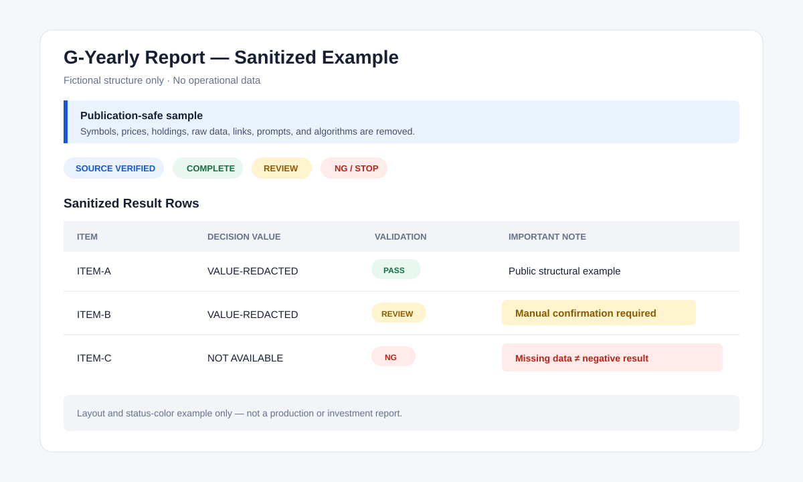

# Report Systems
> [!NOTE]
> **Document baseline:** 2026-08-24. Reference environment: individual ChatGPT Plus account using ChatGPT web/Work without direct OpenAI API calls. Architectural principles are general; observed behavior depends on the tested plan, context, permissions, connected apps, and rollout. Revalidate after material product changes.
> **기준:** 2026년 8월 24일. 참조 환경: ChatGPT 웹/Work를 사용하며 직접 OpenAI API를 호출하지 않는 개인 ChatGPT Plus 계정. 아키텍처 원칙은 일반적이지만, 관찰된 동작은 테스트한 플랜, 맥락, 권한, 연결된 앱 및 배포 상태에 따라 달라집니다. 중요한 제품 변경 후 다시 검증하십시오.

> [!CAUTION]
> **Use at your own risk.** This material is provided for technical education and general information only, without warranties. Evaluate, test, secure, back up, and legally review any implementation. See the [Disclaimer](../DISCLAIMER.md).
> **사용 시 주의.** 본 자료는 교육 및 일반 정보 제공 목적이며, 어떠한 보증도 제공하지 않습니다. 모든 구현을 직접 평가·테스트하고, 보안과 백업을 확인하며, 필요한 법적 검토를 수행하십시오. [면책 조항](../DISCLAIMER.md)을 참조하십시오.

Sanitized report-system architecture and case studies.

## 매매 레포트

- [매매 레포트 전체 기능 목록과 처리 흐름](trading-report/README.md)
- [E. 결과 요청 및 분석 상세설계](trading-report/result-request-analysis.md)

## Existing report documents

- [G-Yearly Report: Google Drive–Based Case Study](g-yearly-report.md)
- [Yearly-Candle Monitoring Report System](yearly-candle-monitoring-report.md)
- [Yearly Report Email Delivery Module](yearly-report-email-delivery.md)
- [Retired Report TAG Optimization](retired-report-tag-optimization.md)
- [Sanitized Report TAG Diagnostic Sample](report-tag-diagnostic-sample.md)
- [Download the sanitized color-coded HTML example](sanitized-g-yearly-report-example.html)

The example uses only fictional identifiers and redacted placeholders. These documents exclude raw data, real symbols, prices, holdings, recipients, private prompts, and core decision algorithms.
