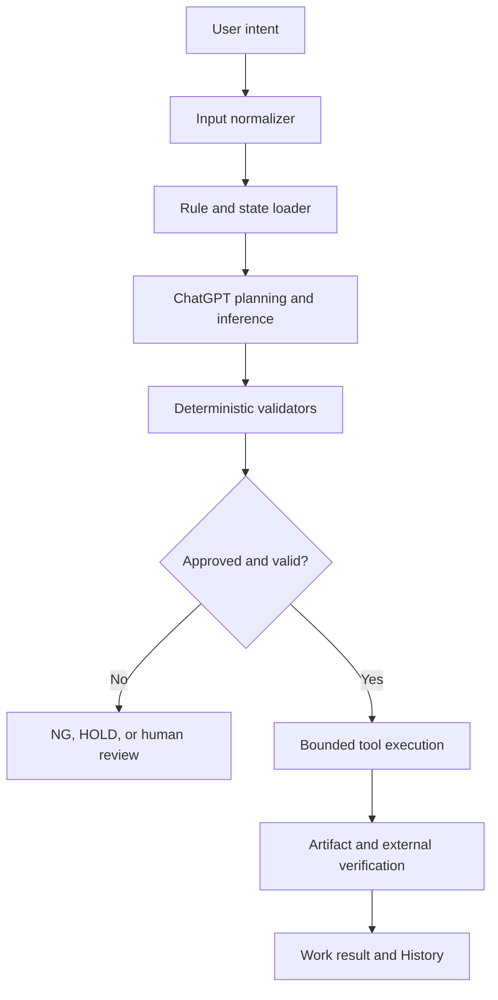

# Developer Approach for Rule-and-Inference Systems

> [!NOTE]
> **Document baseline:** 2026-08-24. Reference environment: individual ChatGPT Plus account using ChatGPT web/Work without direct OpenAI API calls. Architectural principles are general; product behavior and observed limitations are specific to the tested plan, context, permissions, connected apps, and rollout state. Revalidate after material product changes.

## 1. Purpose

A ChatGPT-centered system operates through a combination of:

- Explicit rules
- Available context
- Model inference
- Tool selection
- External data
- Validation
- Human approval

Developers create fewer problems when they do not treat all of these as one opaque “AI behavior.”

The core design principle is:

> Use deterministic software for facts, state, constraints, calculations, and irreversible actions. Use ChatGPT inference for interpretation, planning, summarization, prioritization, and bounded exception handling.

This document focuses on a ChatGPT Plus and no-direct-OpenAI-API reference environment, but the architectural principles also apply to API-based agent systems.

## 2. Two Engines, Not One

### Deterministic rule engine

The rule engine should own:

- Stable identifiers
- Live and Development state
- Required fields
- Exact calculations
- Threshold application
- Allowed status transitions
- Duplicate constraints
- Execution order
- Source-version checks
- Permission requirements
- Transaction boundaries
- Idempotency keys
- Output schema validation
- Audit records

Given the same verified inputs and rule version, it should produce the same machine result.

### Inference engine

ChatGPT should handle:

- Understanding natural-language intent
- Mapping user requests to MENU or CMD
- Planning a multi-step task
- Identifying missing information
- Explaining results
- Summarizing logs
- Comparing alternatives
- Classifying ambiguous feedback
- Suggesting a recovery approach
- Drafting reports and replies
- Escalating material decisions

Inference output must not silently become authoritative state.

## 3. Recommended Architecture

ChatGPT coordinates the flow, but deterministic gates control whether the operation may proceed.

## 4. Contract-First Development

Before writing prompts or automations, define a workflow contract.

### Input contract

- Accepted command or request forms
- Required and optional fields
- Data types
- Allowed ranges
- Source identities
- Expected version
- Ambiguity behavior
- Missing-input behavior

### Rule contract

- Scope
- Mode: Development or Live
- Active state
- Priority
- Effective period
- Dependencies
- Conflict set
- Approval requirement
- Version
- Previous-value relationship

### Output contract

- Required fields
- Allowed statuses
- Sorting
- Counts
- Source timestamps
- Evidence references
- Warning representation
- Failure representation
- Definition of completion

### Side-effect contract

- What may be read
- What may be written
- What requires confirmation
- Idempotency key
- Retry limit
- Rollback behavior
- Verification method

A good prompt explains the contract. It does not replace it.

## 5. Separate Facts, Rules, and Inference

Every value should be classified.

### Fact

A value retrieved from a verified source:

- File version
- Market value
- Message identity
- Database state
- Tool result

Facts require source and timestamp.

### Rule

An approved instruction:

- Which value to use
- Which status transition is allowed
- Which fields are required
- Whether an item is excluded
- When human approval is required

Rules require version, mode, and authority.

### Inference

A model-produced interpretation:

- Likely intent
- Risk assessment
- Suggested classification
- Recommended next step
- Draft response

Inference requires validation or approval before it becomes a fact or rule.

A common failure is storing an inference as if it were a verified fact.

## 6. Explicit State Machines

Do not let ChatGPT invent workflow state names dynamically.

Define states such as:

- Registered
- In Progress
- Waiting for Data
- Waiting for Validation
- Waiting for User
- Completed
- NG
- HOLD
- Cancelled
- Timed Out
- Superseded

For every state, define:

- Allowed previous states
- Allowed next states
- Entry conditions
- Required result fields
- Retry behavior
- Terminal or non-terminal status
- Human approval requirement

Reject an invalid transition rather than asking ChatGPT to “make it fit.”

## 7. Idempotency and Retry

Repeated tool execution is a major risk.

Every external write should include an idempotency concept based on:

- Operation type
- Target identity
- Rule version
- Input checksum
- Work item
- Attempt number

Before retrying, check whether the side effect already occurred.

Examples:

- A file may have been updated even if result recording failed.
- An email may have been sent even if delivery verification failed.
- A GitHub comment may exist even if the local work record is incomplete.

Retry must be bounded and evidence-based.

## 8. Fail Closed

When required data or validation is unavailable:

- Do not guess.
- Do not reuse an old result silently.
- Do not convert missing data into a negative result.
- Do not claim completion.
- Do not perform a high-impact write.
- Record the exact missing stage.
- Return NG, HOLD, or human review.
- Preserve a safe continuation point.

A confident explanation is not evidence of operational success.

## 9. Verification After Execution

Tool-call acceptance is not the final result.

Use a three-level model:

1. **Requested** — the system attempted the operation.
2. **Accepted** — the external tool accepted it.
3. **Verified** — the resulting artifact or external state was checked.

Examples:

- Generated report versus validated report
- Send request versus sent message
- Updated file versus correct current file contents
- Created commit versus expected public rendering
- Downloaded attachment versus successfully parsed attachment

## 10. Evaluation and Regression Testing

Generative output is variable, so traditional exact-string tests are insufficient for every layer.

Use several test types.

### Deterministic tests

- Schema
- Calculations
- Status transitions
- Duplicate checks
- Parser rules
- Source-version checks
- Counts
- Checksums
- Permissions

### Scenario evaluations

- Ambiguous command
- Conflicting rules
- Missing source
- Stale memory
- Old scheduled prompt
- Partial external failure
- Duplicate retry
- Long-context drift
- New session continuation
- Private-data leakage attempt

### Output rubric

Check:

- Required content present
- Prohibited content absent
- Correct status
- Correct source
- No unsupported claim
- Approval boundary respected
- Explanation quality
- Recovery point included

### Release regression set

Every material prompt, rule, model, connector, or workflow change should run the same representative dataset before Live promotion.

## 11. Observability

A system cannot be debugged if it records only the final answer.

Record:

- Request identity
- Work item
- Session GUID
- Rule version
- Source identities and timestamps
- Normalized input
- Selected MENU or CMD
- Planned stages
- Tool calls and summarized results
- Validation outcomes
- External side-effect evidence
- Final state
- NG reason
- Continuation point
- User approval

Do not log secrets or private raw data unnecessarily.

## 12. Prompt Design

Prompts should be short enough to inspect and stable enough to version.

A durable operational prompt should include:

- Goal
- Authoritative sources
- Hard constraints
- Required output
- Failure behavior
- Tool boundaries
- Approval boundary
- Definition of done

Avoid:

- Repeating the same instruction in conflicting wording
- Embedding volatile data directly into a long prompt
- Relying on “be careful” without machine checks
- Asking for hidden reasoning
- Mixing unrelated workflows
- Letting free text override Live rules

Store changing values in structured sources rather than copying them into many prompts.

## 13. Tool Design

Expose only the tools needed for the task.

A tool should have:

- Clear name
- Narrow purpose
- Typed inputs
- Required fields
- Explicit side effects
- Predictable result states
- Safe error messages
- Verification path

Separate tools where risk differs:

- Read versus write
- Generate versus send
- Validate versus promote
- Draft versus publish
- Fetch email versus download attachment
- Create file versus replace file

Do not give two concurrent tasks write access to the same source without locking or version guards.

## 14. Human Approval

Human review is required for:

- Live rule changes
- Publication of a new information category
- Sending material external communication
- Deleting or overwriting important data
- Resolving ambiguous business rules
- Accepting private-data exposure risk
- Retrying an operation with uncertain side effects
- Re-enabling automation after repeated NG
- Changing core architecture

Routine, reversible, validated operations may be automated only after successful manual tests.

## 15. Security and Privacy

Developers should assume that connected content can contain untrusted instructions.

Controls include:

- Least privilege
- Read-only access by default
- Explicit write permission
- Source allowlists
- Data classification
- Prompt-injection awareness
- Output redaction
- Publication gate
- Secret separation
- Audit logs
- Human review for sensitive operations

Public examples must not reconstruct the private trading algorithm or expose operational data.

## 16. Plus and No-API Implementation Strategy

Without directly using the OpenAI API, developers have less control over low-level model invocation but can still build a disciplined system.

### Use ChatGPT for

- Interactive planning
- Work execution
- Connected-app coordination
- Document generation
- GitHub maintenance
- Scheduled monitoring
- Human review loops

### Use durable external structures for

- Rule database
- Work database
- Versioned documents
- Private master files
- Test cases
- Backup manifests
- Source inventories
- Recovery checkpoints

### Accept product boundaries

- Tool availability may vary.
- Context is not infinite.
- Memory is not authoritative.
- Scheduled tasks use saved prompts and available sources.
- External results need verification.
- Exact historical replay is not guaranteed.

The developer's job is to make these boundaries visible rather than pretending they do not exist.

## 17. Recommended Development Sequence

### Phase 1: Observe

- Perform the work manually.
- Record real steps and failure points.
- Separate facts, rules, and judgment.

### Phase 2: Specify

- Define inputs, outputs, states, and authority.
- Define public/private boundaries.
- Define completion and failure.

### Phase 3: Make deterministic

- Move calculations, validation, identifiers, and state transitions into structured logic.
- Add schema and constraints.
- Add idempotency.

### Phase 4: Add ChatGPT inference

- Add intent interpretation.
- Add planning and explanation.
- Limit inference to bounded decisions.
- Add escalation.

### Phase 5: Validate

- Test expected, edge, failure, and adversarial cases.
- Compare with last-known-good results.
- Record failures.

### Phase 6: Development-to-Live

- Register changes in Development.
- Run regression tests.
- Review differences.
- Obtain approval.
- Promote atomically.
- Preserve History.

### Phase 7: Automate

- Schedule only after manual success.
- Start read-only where possible.
- Review early runs.
- Add bounded retries.
- Pause after repeated NG.

### Phase 8: Operate and recover

- Monitor drift.
- Review memory and sources.
- Maintain backups.
- Practice restore procedures.
- Update tests after every incident.

## 18. Common Anti-Patterns

### One giant prompt

Combines rules, data, history, and tools in one unversioned block.

### Memory as database

Assumes remembered summaries are complete and synchronized.

### Chat completion equals success

Treats a confident response as proof of external execution.

### Direct-to-Live editing

Changes production behavior without Development validation.

### Automatic retry without idempotency

Repeats sends, writes, or publications.

### Silent fallback

Uses stale data when the current source fails.

### Unlimited tool access

Lets an inference choose high-impact actions without narrow permissions.

### No negative tests

Tests only successful examples.

### Backup without restore test

Copies files but never proves that the system can resume.

### Publishing real examples

Leaks core algorithms or operational data through “sample” content.

## 19. Developer Review Checklist

Before release:

- [ ] Authoritative sources defined
- [ ] Facts, rules, and inference separated
- [ ] Input and output contracts defined
- [ ] State transitions validated
- [ ] Idempotency implemented
- [ ] Retry bounded
- [ ] Missing data fails closed
- [ ] External result verified
- [ ] Human approval boundaries defined
- [ ] Public/private policy checked
- [ ] Regression tests passed
- [ ] Scheduled prompt versioned
- [ ] Backup checkpoint created
- [ ] Restore path tested
- [ ] History updated
- [ ] Continuation point recorded

## 20. Official References

- [Run verified operations](https://learn.chatgpt.com/use-cases/verified-operations-workflows)
- [Evaluation best practices](https://learn.chatgpt.com/api/docs/guides/evaluation-best-practices)
- [Guardrails and human review](https://learn.chatgpt.com/api/docs/guides/agents/guardrails-approvals)
- [Long-running agent work](https://learn.chatgpt.com/blog/run-long-horizon-tasks-with-codex)
- [Prompting](https://learn.chatgpt.com/docs/prompting)
- [Long-running work](https://learn.chatgpt.com/docs/long-running-work)

## 21. Summary

Developers should not try to make ChatGPT deterministic by writing an increasingly large prompt.

They should build a deterministic operating shell around probabilistic inference.

Rules, state, calculations, permissions, validation, and recovery remain explicit. ChatGPT provides interpretation, coordination, and bounded judgment.

That architecture makes failures visible, reduces rule drift, and allows the system to recover when behavior changes.
